# oscript-stack

Реализация структуры данных **Стек** (LIFO — Last In, First Out) для [OneScript](https://oscript.io/).



## Возможности

Объект `Стек` поддерживает базовый набор операций стека. Каждая операция доступна под англоязычным и русскоязычным именем — это разные методы с одинаковым поведением, работающие с одним и тем же внутренним хранилищем, их можно свободно смешивать на одном объекте.

Для `pop()` и `peek()` подобрать один русскоязычный вариант, идеально описывающий суть операции, оказалось непросто — на этих двух операциях в таблице ниже несколько равноправных синонимов. Используйте тот, что лучше звучит в вашем коде.

| Методы | Описание |
|---|---|
| `push(значение)`<br>`Добавить(Значение)` | Добавляет элемент на вершину стека |
| `pop()`<br>`Извлечь()`<br>`Взять()`<br>`Забрать()`<br>`Следующий()` | Удаляет и возвращает элемент с вершины стека. Бросает исключение, если стек пуст |
| `peek()`<br>`Прочитать()`<br>`Вершина()`<br>`Верхний()`<br>`Заглянуть()` | Возвращает элемент с вершины стека, не удаляя его. Бросает исключение, если стек пуст |
| `count()`<br>`Количество()` | Возвращает количество элементов в стеке |
| `empty()`<br>`Пустой()` | Возвращает `Истина`, если стек не содержит элементов |
| `contains(значение)`<br>`Содержит(Значение)` | Возвращает `Истина`, если указанное значение присутствует среди элементов стека |
| `clear()`<br>`Очистить()` | Удаляет все элементы из стека |

Стек может хранить значения любого типа, включая объекты — `pop()`/`peek()` (и их алиасы) возвращают тот же самый объект, который был передан в `push()`, без копирования. `contains()`/`Содержит()` сравнивает значения строгим равенством: для примитивов (числа, строки и т.п.) — по значению, для объектов — по ссылке.

## Установка

Пакет пока не публикуется через [opm](https://github.com/oscript-library/opm) — подключите файл `src/stack.os` в своём проекте как сценарий:

```bsl
ПодключитьСценарий(ОбъединитьПути(ТекущийСценарий().Каталог, "src", "stack.os"), "Стек");
```

После этого тип `Стек` доступен для создания через `Новый Стек`.

## Использование

```bsl
Стек = Новый Стек;

Стек.push(1);
Стек.push(2);
Стек.push(3);

Сообщить(Стек.count()); // 3
Сообщить(Стек.peek());  // 3, стек не изменился

Пока Не Стек.empty() Цикл
	Сообщить(Стек.pop());
КонецЦикла;
// выведет: 3, 2, 1

Стек.push(1);
Стек.clear();
Сообщить(Стек.empty()); // Истина

Стек.push(1);
Стек.push(2);
Сообщить(Стек.contains(2));  // Истина
Сообщить(Стек.contains(35)); // Ложь
```

То же самое через русскоязычный фасад (методы взаимозаменяемы на одном и том же объекте):

```bsl
Стек = Новый Стек;

Стек.Добавить(1);
Стек.Добавить(2);
Стек.Добавить(3);

Сообщить(Стек.Количество()); // 3
Сообщить(Стек.Прочитать());  // 3, стек не изменился

Пока Не Стек.Пустой() Цикл
	Сообщить(Стек.Извлечь());
КонецЦикла;
// выведет: 3, 2, 1
```

Попытка получить элемент из пустого стека (`pop()`/`Извлечь()` или `peek()`/`Прочитать()`) бросает исключение с текстом `stack underflow`:

```bsl
Стек = Новый Стек;

Попытка
	Стек.pop();
Исключение
	Сообщить(ОписаниеОшибки()); // stack underflow: attempt to get element out of empty stack object
КонецПопытки;
```

## Тесты

Тесты находятся в `tests/stack.os` и написаны с использованием библиотек [asserts](https://github.com/oscript-library/asserts) и [1testrunner](https://github.com/oscript-library/1testrunner). Для запуска установите оба пакета через `opm`, затем выполните:

```
opm install asserts
opm install 1testrunner
1testrunner -runall tests
```
